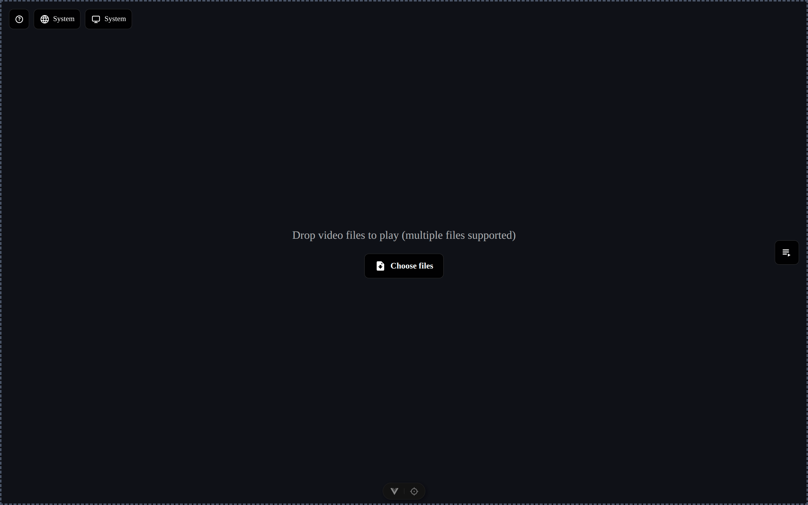

# Drop Play

Language: English | [中文](./README.zh-CN.md)

[Live Demo](https://taipaxu.github.io/drop-play/) | [Download HTML](https://github.com/TaipaXu/drop-play/releases/latest/download/drop-play.html)

Drop Play is a lightweight local video player. Drop or choose video files on the page to start playback, or add multiple files at once to build a playlist. It is designed for local viewing with no uploads, no backend, and minimal setup.

## Preview



## Features

- Drag and drop or choose video files to play immediately, with multi-file support.
- Playlist panel with selection, removal, clearing, sorting, and drag-to-reorder.
- Player controls for progress, buffered progress, hover preview, volume, mute, speed, fullscreen, and HDR-style visual enhancement.
- Screenshot capture with filenames based on the current video and playback timestamp.
- Auto-hiding controls during playback, restored by mouse movement.
- Chinese, English, and system-language modes.
- Local-only playback through browser `Object URL`s.

## Keyboard Shortcuts

| Shortcut | Action                  |
| -------- | ----------------------- |
| `Space`  | Play / pause            |
| `←`      | Seek back 10 seconds    |
| `→`      | Seek forward 10 seconds |
| `↑`      | Volume up               |
| `↓`      | Volume down             |
| `[`      | Decrease speed          |
| `]`      | Increase speed          |
| `P`      | Previous item           |
| `N`      | Next item               |
| `M`      | Mute / unmute           |
| `F`      | Enter / exit fullscreen |
| `S`      | Screenshot              |
| `?`      | Show / hide shortcuts   |

Compatible hardware media keys can also control play, pause, stop, and previous
or next item when supported by the browser and keyboard.

## Tech Stack

- [Vite+](https://viteplus.dev/guide/) as the unified web toolchain and `vp` CLI.
- [Vue](https://vuejs.org/) for the application UI.
- [Pinia](https://pinia.vuejs.org/) for playlist state management.
- [TypeScript](https://www.typescriptlang.org/) for typed application code.
- [vite-plugin-singlefile](https://github.com/richardtallent/vite-plugin-singlefile) for single-file HTML builds.

## Runtime

- Node.js: `24.17.0`
- Package manager: `pnpm@11.5.2`
- Vite+ reads these settings from `package.json`.

First-time runtime setup:

```bash
vp env setup
vp env on
vp env install
```

## Development

Install dependencies:

```bash
vp install
```

Start the development server:

```bash
vp dev
```

## Build

Run the project build script through Vite+. This runs Vue type checking and the Vite+ production build in parallel:

```bash
vp run build
```

Use `vp build` only when you want to run the built-in Vite+ production build directly without the project script.

After building, preview the production build locally:

```bash
vp preview
```

The production build inlines assets and outputs a single HTML file:

```text
dist/drop-play.html
```

This makes Drop Play suitable for single-file distribution and offline use.

## Validation

```bash
vp check
```

Run `vp help` to see the full list of Vite+ commands, or `vp <command> --help` for command-specific help.

## License

This project is licensed under the [MIT License](./LICENSE).

## Compatibility Notes

Drop Play filters files by common video extensions, but actual playback still depends on the browser's support for the file container and codec. For best results, use browser-friendly formats such as `mp4`, `webm`, and `mov`.
